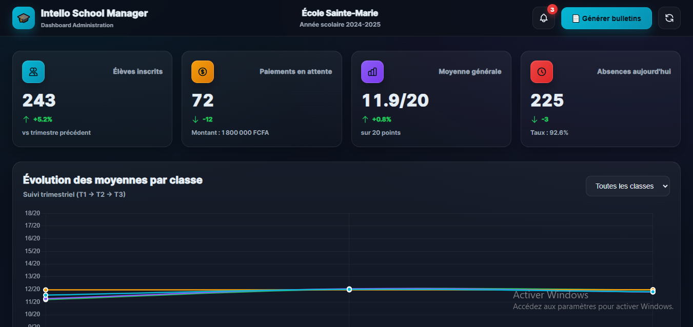
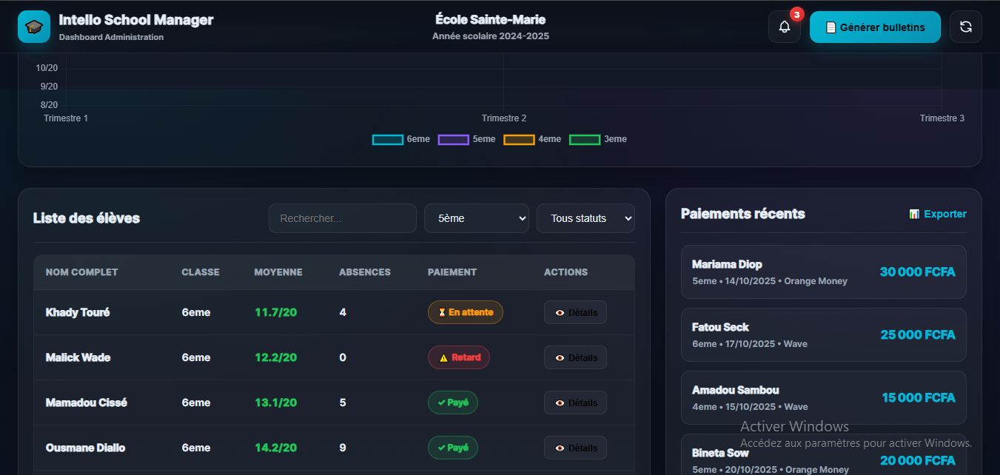

# 🎓 Intello School Manager — Prototype Éducation (Dashboard Admin)


Prototype d’administration scolaire avec KPIs, graphique d’évolution des moyennes par classe, gestion des élèves (filtres/recherche) et suivi des paiements récents.

Développé par [Intello](https://github.com/intello-agence).

---

## 📋 Vue d’ensemble

Fonctionnalités principales :
- KPIs temps réel (CountUp.js)
  - Élèves inscrits
  - Paiements en attente (+ montant total estimé)
  - Moyenne générale établissement
  - Absences du jour (+ taux)
- Graphique Chart.js
  - Évolution des moyennes par classe (6ème → 3ème) sur 3 trimestres
  - Filtre par classe (ou toutes classes)
- Élèves
  - Table filtrable et recherchable (classe, statut de paiement, recherche par nom)
  - Badges paiement (✓ Payé, ⏳ En attente, ⚠️ Retard)
  - Détails élève (modal) : moyenne, absences, paiement, notes par matière (simulation)
- Paiements récents
  - Liste des 10 derniers paiements (montant, date, méthode Wave/Orange Money)
  - Bouton Export (placeholder)
- Bulletins PDF (modal)
  - Sélection trimestre + classe
  - Barre de progression simulée
  - Toast de succès à la fin

Technologies :
- HTML5 sémantique (ARIA, skip link)
- CSS3 (glassmorphism, responsive, animations)
- Vanilla JavaScript ES6+ (IIFE, strict mode)
- Chart.js 4.4.0 (graphique)
- CountUp.js 2.8.0 (KPIs)

---

## ✨ Détails des fonctionnalités

### KPIs (header dashboard)
- Animations numériques (CountUp)
- Badges de variation (positif/negatif) avec code couleur
- Calculs automatiques à partir de données simulées (notes, paiements, absences)

### Graphique (moyennes par classe)
- Ligne multi-datasets (6ème, 5ème, 4ème, 3ème)
- Simulation de progression T1 → T2 → T3
- Filtre par classe (drop-down) avec mise à jour instantanée

### Table Élèves
- Recherche live par nom (debounce 300ms)
- Filtres par classe et par statut de paiement
- Badges statut: paid / pending / late
- Bouton “Détails” → modal fiche élève (infos + notes par matière générées)

### Paiements récents
- 10 dernières entrées (élève, classe, montant, date, méthode)
- Bouton Export (placeholder — toast d’information)

### Génération des bulletins
- Modal avec trimestre + classe
- Barre de progression 0 → 100%
- Toast de succès à la fin

---

## 🖼️ Screenshots

### Dashboard principal (KPIs + Graphique + Filtres)


### Table des élèves (Filtres + Recherche)


---

## 📦 Installation & Utilisation

Prérequis
- Navigateur moderne (Chrome 90+, Firefox 88+, Safari 14+, Edge 90+)
- Aucun build requis (CDN Chart.js & CountUp.js)

Lancement rapide
1. Cloner le repository
   ```bash
   git clone https://github.com/intello-agence/education-platform-prototype.git
   cd education-platform-prototype
   ```

2. Ouvrir dans le navigateur
   - Méthode 1 (simple) : Double-clic sur index.html
   - Méthode 2 (serveur local) :
     ```bash
     # Python 3
     python -m http.server 8000
     # puis visiter http://localhost:8000

     # Node.js
     npx http-server -p 8000
     ```

3. Tester
   - Filtrer la table (classe, paiement)
   - Rechercher un élève (ex: “Amadou”)
   - Ouvrir la modal “Générer bulletins” et lancer la progression
   - Changer la classe du graphique

---

## 🗂️ Structure du projet

```
education-platform-prototype/
├── index.html          # Page principale (HTML5 sémantique + ARIA)
├── styles.css          # Styles (glassmorphism, responsive, a11y)
├── app.js              # Logique (KPIs, Chart.js, tables, modals)
├── screenshots/        # Captures d'écran
│   ├── dashboard_main.png
│   └── students_table.png
└── README.md           # Documentation
```

---

## 🎨 Design System

Palette
- Background: #0a0f1a → #0b1220 (dégradé)
- Accents: Cyan #06b6d4, Purple #8b5cf6
- États: Success #22c55e, Warning #f59e0b, Danger #ef4444
- Surfaces: glassmorphism rgba(255,255,255,0.03-0.06)

Typographie
- Inter (fallback: system-ui)
- Poids: 400 / 600 / 700 / 800

Responsive
- 1200px: KPIs en 2 colonnes; data-section en 1 colonne
- 768px: header wrap; school-info passe dessous; table filtres en colonne; chart height 260px; footer en colonne

---

## 🛠️ Stack Technique (détaillé)

| Composant | Tech | Version | Usage |
|---|---|---|---|
| Front-end | HTML5 | — | Sémantique, ARIA, skip link |
| Styles | CSS3 | — | Glassmorphism, grid/flex, responsive |
| Logic | Vanilla JS | ES6+ | IIFE, modules pattern, events |
| Graphique | Chart.js | 4.4.0 | Ligne multi-datasets |
| KPIs | CountUp.js | 2.8.0 | Animations numériques |
| CDN | jsDelivr/cdnjs | — | Scripts non-bloquants (defer) |

---

## ⚡ Performance & Optimisations

- Debounce recherche (300ms)
- Chart.js destroy avant re-création (pas de memory leak)
- Canvas responsive (maintainAspectRatio: false)
- CSS will-change pour animations
- Scripts Chart/CountUp en `defer` (rendu non bloqué)

---

## 🔐 Sécurité & Accessibilité

Sécurité
- Échappement HTML (escapeHTML) pour tout innerHTML dynamique
- Aucune exécution arbitraire (pas de eval)
- Données 100% fictives côté client

Accessibilité
- Skip link
- ARIA sur modals (role="dialog", aria-modal, aria-labelledby)
- aria-live pour KPIs et progress
- Focus visible personnalisé
- Table avec scope col et min-width + scrolling horizontal

---

## 🧪 Tests manuels (checklist)

Fonctionnel
- [ ] Recherche élève (“Amadou”) → résultats filtrés
- [ ] Filtre classe (“4ème”) → table mise à jour
- [ ] Filtre paiement (“En attente”) → badges 🟡
- [ ] Ouvrir “Détails” élève → modal (notes par matière)
- [ ] Graphique : changer “Classe” → datasets mis à jour
- [ ] “Générer bulletins” → progression 0→100% + toast succès
- [ ] “Rafraîchir” → données régénérées + toast

Accessibilité
- [ ] Navigation clavier (Tab, Shift+Tab)
- [ ] Escape ferme les modals
- [ ] Skip link visible au focus
- [ ] Focus visible sur tous les interactifs
- [ ] aria-live pour progress/compteurs

---

## 📝 Limitations & Roadmap

Limitations (prototype)
- Données fictives (pas d’API)
- Export paiements = placeholder (toast)
- Bulletins PDF simulés (pas de génération réelle)
- Pas d’authentification

Roadmap (prod)
- Backend API (Node/Express + DB)
- Authentification (JWT)
- Génération PDF réelle (Puppeteer/PDFKit)
- Historique paiements + export CSV/Excel
- Notifications temps réel (WebSocket)
- Profils élèves (parents, contacts, années précédentes)
- Tests E2E (Playwright/Cypress)
- CI/CD (GitHub Actions)

---

## 👤 Auteur

**Patrick Junior Samba Ntadi**  
Fondateur — Intello  
📍 Dakar, Sénégal

- GitHub : [@intello-agence](https://github.com/intello-agence)

---

## 📄 Licence

MIT License — Libre d’utilisation pour démonstration/apprentissage.

Note : Ce projet est un prototype de démonstration destiné à illustrer les compétences techniques d’Intello. Les données sont fictives et ne doivent pas être utilisées en production.

---

## 🙏 Crédits

- Charting : [Chart.js](https://www.chartjs.org)
- KPIs : [CountUp.js](https://inorganik.github.io/countUp.js/)
- Icônes : Emojis + SVG inline
- Inspiration UI : Dashboards école/edtech modernes

---

**✨ Conçu par Intello | © 2025**